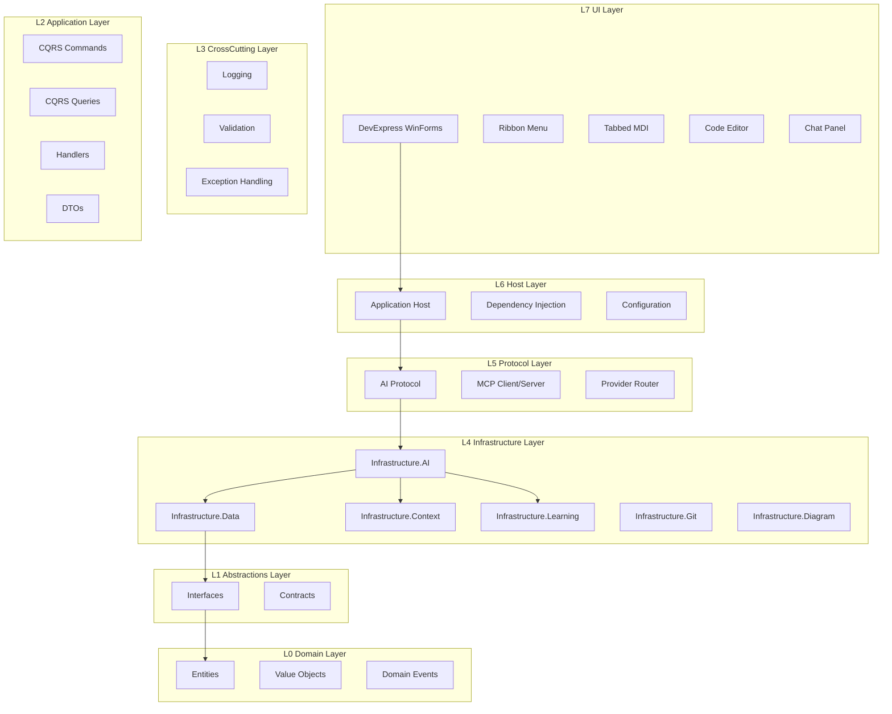
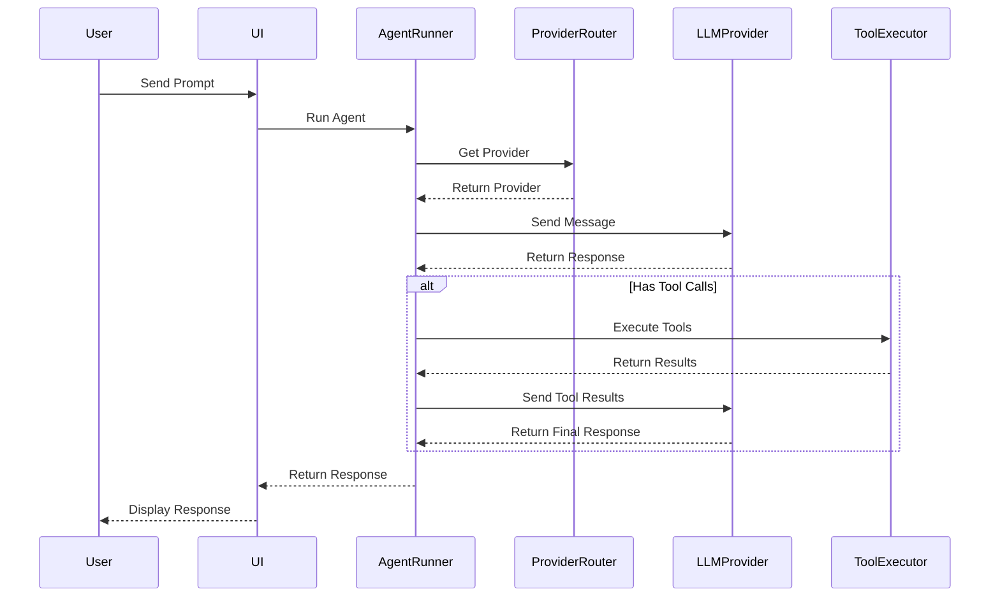
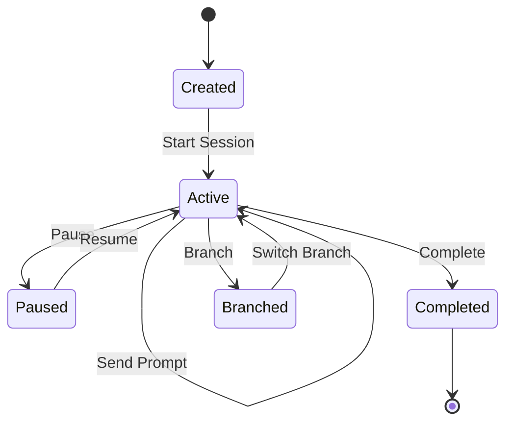
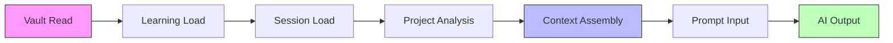

# System Architecture Diagram

## 1. High-Level Architecture

## 2. AI Provider Flow

## 3. Session Flow

## 4. Context Assembly Flow

---

**Authority:** Vault Steward  
**Last Updated:** 2026-08-25
